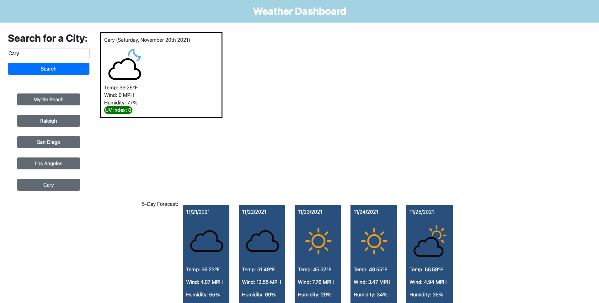

# Weather-Planner

## Description 
Weather-Planner is a simple application to quickly recieve current and future weather data for the users desired city. Once a user inputs a city name, they will be presented with current weather data including the UV index and whether it is favorable, moderate, or severe. They will also be presented with a 5-day forecast. Inputted cities will be saved into buttons under the search form. If a user clicks on a button, the weather data for that city will be presented to the user.

## Built With
* HTML
* CSS
* JavaScript

## Link to Deployed Application
https://osamadahnoun.github.io/Weather-Planner/

## Screenshot of Deployed Application

## Contribution
Weather Planner created and designed with ❤️ by Osama Dahnoun